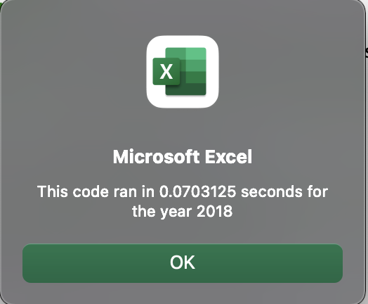
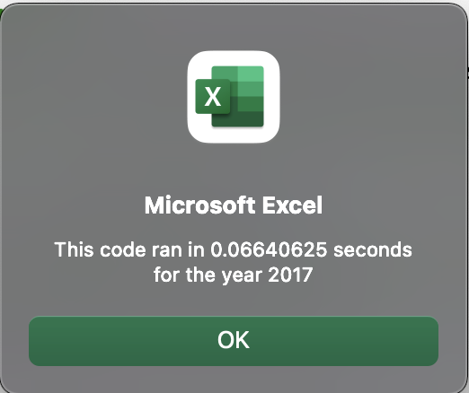

# VBA_Challenge
## Overall View of Project

 

#### 
 The overall purpose of this project was to provide a Macro to Steve that would be able to loop through a data Stock and output analysis for each stock. An additional goal was to make it easily usable, which included a button to run the analysis for a specific year, and also clear the previous cell’s contents. Finally, we refactored the code, so that our Macro is scalable to larger sets of data. 

 

## Results

 

### 
 Stock Analysis

 

#### 
 As a whole, 2017 was far more successful for trading that 2018 was. In 2017, all but one stock had positive returns. However, in 2018 only two stocks returned positive values. 

 

## Coding Analysis

 

### 
Refractored Code  

 

 Sub AllStocksAnalysisRefactored()  
    Dim startTime As Single
    Dim endTime    As Single

    yearValue = InputBox("What year would you like to run the analysis on?")

    startTime = Timer
    
    'Format the output sheet on All Stocks Analysis worksheet
    Sheets("All Stocks").Activate
    
    Range("A1").Value = "All Stocks (" + yearValue + ")"
    
    'Create a header row
    Cells(3, 1).Value = "Ticker"
    Cells(3, 2).Value = "Total Daily Volume"
    Cells(3, 3).Value = "Return"

    'Initialize array of all tickers
    Dim tickers(12) As String
    
    tickers(0) = "AY"
    tickers(1) = "CSIQ"
    tickers(2) = "DQ"
    tickers(3) = "ENPH"
    tickers(4) = "FSLR"
    tickers(5) = "HASI"
    tickers(6) = "JKS"
    tickers(7) = "RUN"
    tickers(8) = "SEDG"
    tickers(9) = "SPWR"
    tickers(10) = "TERP"
    tickers(11) = "VSLR"
    
    'Activate data worksheet
    Sheets(yearValue).Activate
    
    'Get the number of rows to loop over
    RowCount = Cells(Rows.Count, "A").End(xlUp).Row
    
    '1a) Create a ticker Index
    tickerIndex = 0
    

    '1b) Create three output arrays
    
    Dim tickerVolumes(12) As Long
    Dim tickerStartingPrices(12) As Single
    Dim tickerEndingPrices(12) As Single
    
    
    '2a) Create a for loop to initialize the tickerVolumes to zero.
    
        For i = 0 To 11
    
            ' unecessary -> tickerIndex = tickers(i)
        
            tickerVolumes(i) = 0
            
        Next i
        
    
   '^^^^^^^^^^^^^^^^^^^^^^^^^^^^^^^^^^^^^^^^^^^^^^^^^^^^^^^^^^^^^^^^^^^^  
   ' Setting our variables up pre For loop.
        
    '2b) Loop over all the rows in the spreadsheet.
                For i = 2 To RowCount
    
            '3a) Increase volume for current ticker
            
                        tickerVolumes(tickerIndex) = tickerVolumes(tickerIndex) + Cells(i, 8).Value
        
             '3b) Check if the current row is the first row with the selected tickerIndex.
             
                        'If  Then
                        If Cells(i - 1, 1).Value <> tickers(tickerIndex) Then
                        
                            ' Why is starting price in the 6th column, but starting price is in column 3 in the data set?
            
                            tickerStartingPrices(tickerIndex) = Cells(i, 6).Value
            
                        'End if
                        End If
            
      
        '3c) check if the current row is the last row with the selected ticker
         'If the next row’s ticker doesn’t match, increase the tickerIndex.
                        'If  Then
                        If Cells(i + 1, 1).Value <> tickers(tickerIndex) Then
            
                            tickerEndingPrices(tickerIndex) = Cells(i, 6).Value
                            
                            '3d Increase the tickerIndex.
                            
                            tickerIndex = tickerIndex + 1
                        
                        'End if
                        End If

    Next i
    
    '4) Loop through your arrays to output the Ticker, Total Daily Volume, and Return.
   
    Sheets("All Stocks").Activate
   
    For i = 0 To 11
    
            Cells(4 + i, 1).Value = tickers(i)
            Cells(4 + i, 2).Value = tickerVolumes(i)
            Cells(4 + i, 3).Value = tickerEndingPrices(i) / tickerStartingPrices(i) - 1
            
    Next i
   
    'Formatting
    Worksheets("All Stocks").Activate
    Range("A3:C3").Font.FontStyle = "Bold"
    Range("A3:C3").Borders(xlEdgeBottom).LineStyle = xlContinuous
    Range("B4:B15").NumberFormat = "#,##0"
    Range("C4:C15").NumberFormat = "0.0%"
    Columns("B").AutoFit

    dataRowStart = 4
    dataRowEnd = 15

    For i = dataRowStart To dataRowEnd
        
        If Cells(i, 3) > 0 Then
            
            Cells(i, 3).Interior.Color = vbGreen
            
        Else
        
            Cells(i, 3).Interior.Color = vbRed
            
        End If
        
    Next i
 
    endTime = Timer
    MsgBox "This code ran in " & (endTime - startTime) & " seconds for the year " & (yearValue)

End Sub

 To achieve faster speeds with the Macro, we added arrays for the Volume, Starting Price, and Ending Price. Furthermore we introduced a tickerIndex so that we could remove the For Loop to designate which ticker we were gathering information from. This tickerIndex can be applied to all of our arrays. 

Another step that we took to improve speed was increasing the tickerIndex by one, inside of the For Loop that was running through all rows in the sheet. This means that we can use just one loop for all rows in the spreadsheet while reliably associating Volume, Starting Price, and Ending Price with the correct tickerIndex. 

This lead to the increased times that are shown below.

 

### 
 Time for 2018 Marco 

 

 

### 
 Time for 2017 Marco 

## 
  Summary 

 

### Advantages and Disadvantages to Refractoring

 

 Advantages: Code can run much quicker, and it will be simpler. Quicker code means that it will be able to handle larger data sets in a practical way. Simpler codes means that it will be easier to fix should something go wrong. 

 

 Disadvantages: It is a very time consuming process, and its possible to actually get the initial code wrong. After I refractored this code, I finally got no bugs but I noticed the numbers that were being pulled were incorrect. Even though it ran perfectly fine, if the values are wrong... what was the point of maiking it faster? Now its just fast and wrong. So there is always the risk that more bad than good will be done to the code. 

 

### Advantages And Disadvantages Of The Original And Refactored Vba Script

 

 Advantages: The code runs much, much, much faster. When you are looking at stocks, many times we will be looking at a very large portfolio. Having this speed is essential if it is to be used in a practical manner. 

 

 Disadvantages: The code DID work perfectly fine. There was the risk of going down rabbit holes and wasting a ton of work time on something that was just optimizing a process. With that being said I feel that refactoring in this instance was necessary. 
